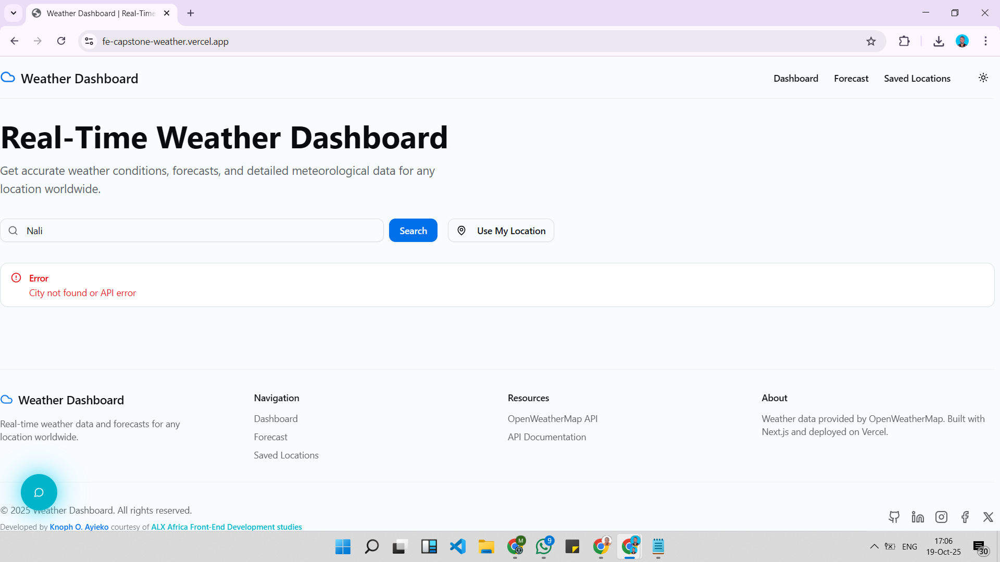
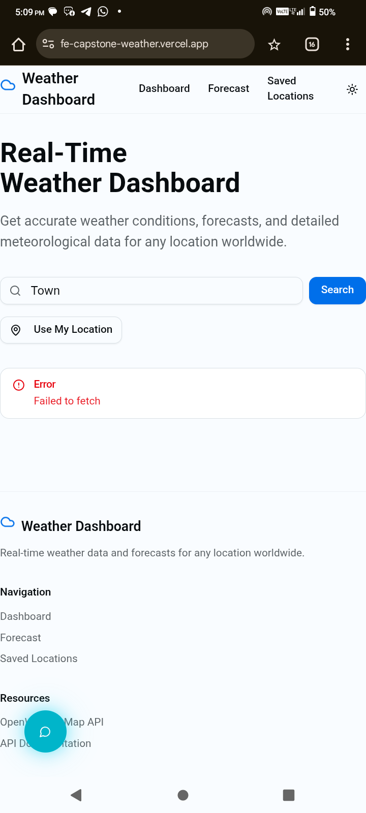

# 🌦️ Weather Dashboard  
---

# fe-capstone-weather-dashboard  
**ALX Front-End Capstone Project**

A professional, fully responsive **Weather Dashboard** built with **React (Vite)** and **Tailwind CSS** *(shifted to **Next.js**)*, delivering real-time weather updates and forecasts using the **OpenWeatherMap API**.  
This project demonstrates modern front-end development best practices — speed, interactivity, accessibility and scalability.

[](https://fe-capstone-weather.vercel.app/)
[](LICENSE)

---

## 🌤️ Overview

The **Weather Dashboard** allows users to check live weather conditions and forecasts for any location worldwide. It is designed with a focus on performance, UX and maintainability.

- Real-time temperature, humidity, wind, pressure and visibility.
- Daily and hourly forecasts (planned).
- Dark/Light theme toggle with smooth transitions.
- Geolocation support (planned).
- Responsive and accessible across devices.

---

## 🚀 Live Demo

Check out the live application here: [Weather Dashboard on Vercel](https://fe-capstone-weather.vercel.app/)

---

## 📂 GitHub Repository
📦 **Repo Link:** [Weather Dashboard on GitHub](https://github.com/Knoph1/fe-capstone-weather-dashboard)

---

## 🎥 Demo Video
📽️ **Loom Recording:** [Watch Demo Presentation - Loom Recording](https://www.loom.com/share/8d8c43f302d247d8ad1059d3a3a73dce?sid=5d376f65-4f87-40c3-b2aa-86e0a7fc7309)

---

## ✨ Features
- 🌍 **Current Weather:** Temperature, feels like, min/max, conditions with icons, humidity, wind, pressure, sunrise/sunset times.
- 📅 **5-Day Forecast:** Daily overview with icons, temperature ranges and weather predictions.
- 🕐 **24-Hour Forecast:** Hourly weather updates *(planned)*.
- 📌 **Saved Locations:** Store frequently searched cities *(planned)*.
- 🌓 **Dark/Light Mode:** Seamless theme switching based on user or system preference.
- 📱 **Responsive Design:** Optimized for desktop, tablet and mobile.
- ⚡ **Fast Development:** Powered by **Next.js (shifted from Vite)** for SSR and SSG.
- ⚠️ **404 Not Found Page:** Custom error page with a clean layout, friendly message and navigation back to the homepage — improving user experience and app completeness.
- 🔍 **SEO & Accessibility:** Clean metadata, semantic HTML, ARIA attributes, descriptive URLs.

---

## 🛠️ Tech Stack

| Category | Technology |
|-----------|-------------|
| **Framework** | Next.js (Originally React + Vite) |
| **Language** | JavaScript (ES6+) |
| **Styling** | Tailwind CSS |
| **API** | OpenWeatherMap |
| **Routing** | React Router DOM *(planned)* |
| **Deployment** | Vercel |
| **Version Control** | Git + GitHub |

---

## 📂 Project Structure
```bash
fe-capstone-weather-dashboard/
├── app/                    # Application routes/pages (Next.js App Router)
│   ├── forecast/           # Forecast feature (layout + page)
│   ├── locations/          # Locations feature (layout + page)
│   ├── globals.css         # Global styles
│   ├── layout.tsx          # Root layout component
│   ├── loading.tsx         # App-level loading screen
│   └── page.tsx            # Home page
├── components/             # Reusable components
│   └── ui/                 # UI building blocks
├── hooks/                  # Custom React hooks
├── lib/                    # Utility functions, API logic and helpers
├── public/                 # Static assets
├── styles/                 # Global or modular stylesheets
├── .env.local              # Environment variables
├── next.config.mjs         # Next.js configuration
├── package.json            # Dependencies, scripts and metadata
├── tailwind.config.js      # TailwindCSS configuration
└── README.md               # Project documentation
```

---  
## ⚙️ Setup & Installation

### Prerequisites
- Node.js 18+ installed  
- API key from [OpenWeatherMap](https://openweathermap.org/api)

### Installation
```bash
# Clone repository
git clone https://github.com/Knoph1/fe-capstone-weather-dashboard.git
cd fe-capstone-weather-dashboard

# Install dependencies
npm install

# Add OpenWeatherMap API key in src/lib/weather.ts
const API_KEY = "api_key"

# Run development server
npm run dev
```

Then open [http://localhost:3000](http://localhost:3000) in your browser.

---

## 🌡️ Detailed Features

### Current Weather
- Temperature, feels like, min/max
- Humidity, wind speed/direction, pressure
- Sunrise and sunset times
- Weather conditions with icons

### Forecast
- 5-day daily overview
- Hourly updates *(planned)*
- Probability of precipitation and cloud coverage

### Saved Locations *(Future Update)*
- Store frequently searched cities
- Persistent storage using `localStorage`
- Delete or update saved cities

### Theme Support
- Light, Dark and System modes
- Smooth animations and transitions

---

## 🌐 API Integration

| Purpose | Endpoint |
|---------|----------|
| Current Weather | `/data/2.5/weather` |
| 5-Day Forecast | `/data/2.5/forecast` |
| Geocoding | `/geo/1.0/direct` |

---

## 📈 Project Progress

- [x] Project initialization with React + Tailwind CSS
- [x] Migrated to Next.js for better performance and deployment
- [x] Dashboard UI design
- [x] Integrated OpenWeatherMap API
- [x] 5-day forecast implementation
- [x] Routing (Dashboard, Forecast and Saved Locations)
- [x] Geolocation & theme switching
- [x] Performance & accessibility optimization
- [x] Deployment to Vercel

---

## 📸 Screenshots

_The following screenshots showcase the Weather Dashboard interface across devices and themes — highlighting responsive design, light/dark modes and major feature pages._

| Desktop View | Mobile View |
|---------------|--------------|
|  |  |
|  |  |
|  |  |
|  |  |
|  |  |

---

## 📜 License

This project is licensed under the **MIT License**.

---

## 🏁 Acknowledgements

- **ALX Africa** & the **Software Engineering Program Team** for mentorship, resources and guidance throughout this learning journey.  
- **OpenWeather** for providing the free weather API service used in this project.  
- **Tailwind CSS**, **React** & **Next.js** communities for their excellent documentation and active developer support.  
- My peers and mentors who offered feedback, encouragement and collaboration during project development.

---

## 💡 Note

> Built with passion and perseverance 💻✨

---

## 👤 Author

**Knoph O. Ayieko**  
💻 Front-End Web Developer | IT Specialist | Researcher

- 🌐 Portfolio: [knoph.dev](https://www.knoph.dev)  
- 💼 LinkedIn: [Knoph Ayieko](https://linkedin.com/in/knoph-ayieko)  
- 🐙 GitHub: [Knoph1](https://github.com/Knoph1)  
- ✉️ Email: [knophayieko@gmail.com](mailto:knophayieko@gmail.com)

---

### © 2025 | Weather Dashboard — ALX Africa Capstone Project  
*Crafted with code, creativity and purpose.*
